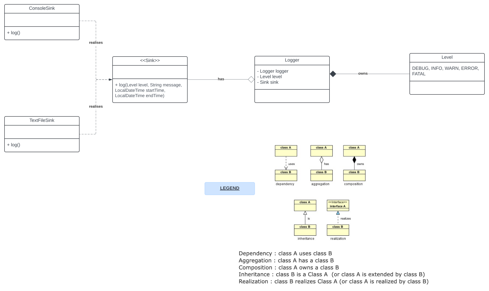

# Logging Library 
by Gaurav Kabra

## Problem Statement


## Setup
Will require `JUnit5.8.1` to run tests.

## Design
[Inspired from `log4j` and `slf4j`]



1. `Sink` is not concrete. `ConsoleSink` and `TextFileSink` are.
2. `Logger` is using **singleton design pattern** so that multiple loggers do not overwrite.
3. We can use **factory design pattern** to create different loggers
 - In that case remove `sink` from `Logger.java` and make it asbtract
 - Then create two sub classes: `ConsoleLogger` and `TextFileLogger`
4. It is requirement that for any level, all higher level logs must also be logged
 - We have used enum's ability to get higher levels using `getHigherOrEqualLevels()` method
 - In general, we can use **chain of responsibility (cor) design pattern** where we create different levels logger and set next logger. Once one logger is done, it delegates to next logger.
 - But in our impl, cor will lead to complexity - extensibility wise if new level is introduced, we need to create new loggers and set next logger, and if level is between two existing loggers, existing classes will need changes to accommodate new logger as next logger
5. If some external logger comes into picture (like slf4j), we need to use **facade design pattern**


### Quick Examples
### Singleton Pattern

Ensure that only one instance of the `Logger` class exists.

```java
public class Logger {
    private static Logger instance;

    private Logger() {
        // Private constructor to prevent instantiation
    }

    public static Logger getInstance() {
        if (instance == null) {
            instance = new Logger();
        }
        return instance;
    }

    public void log(String message) {
        // Log message to console
        System.out.println(message);
    }
}
```

### Factory Pattern

Create different types of loggers using a factory method.

```java
interface ILogger {
    void log(String message);
}

class ConsoleLogger implements ILogger {
    public void log(String message) {
        System.out.println("ConsoleLogger: " + message);
    }
}

class FileLogger implements ILogger {
    public void log(String message) {
        // Log message to a file (simplified)
        System.out.println("FileLogger: " + message);
    }
}

class LoggerFactory {
    public static ILogger getLogger(String type) {
        if (type.equalsIgnoreCase("console")) {
            return new ConsoleLogger();
        } else if (type.equalsIgnoreCase("file")) {
            return new FileLogger();
        }
        throw new IllegalArgumentException("Unknown logger type");
    }
}
```

### Chain of Responsibility Pattern

Handle different logging levels.

```java
abstract class Logger {
    public static int INFO = 1;
    public static int DEBUG = 2;
    public static int ERROR = 3;

    protected int level;

    protected Logger nextLogger;

    public void setNextLogger(Logger nextLogger) {
        this.nextLogger = nextLogger;
    }

    public void logMessage(int level, String message) {
        if (this.level <= level) {
            write(message);
        }
        if (nextLogger != null) {
            nextLogger.logMessage(level, message);
        }
    }

    protected abstract void write(String message);
}

class ConsoleLogger extends Logger {
    public ConsoleLogger(int level) {
        this.level = level;
    }

    @Override
    protected void write(String message) {
        System.out.println("ConsoleLogger: " + message);
    }
}

class ErrorLogger extends Logger {
    public ErrorLogger(int level) {
        this.level = level;
    }

    @Override
    protected void write(String message) {
        System.err.println("ErrorLogger: " + message);
    }
}

// Usage
public class ChainPatternDemo {
    private static Logger getChainOfLoggers() {
        Logger errorLogger = new ErrorLogger(Logger.ERROR);
        Logger consoleLogger = new ConsoleLogger(Logger.INFO);

        errorLogger.setNextLogger(consoleLogger);

        return errorLogger;
    }

    public static void main(String[] args) {
        Logger loggerChain = getChainOfLoggers();

        loggerChain.logMessage(Logger.INFO, "This is an informational message.");
        loggerChain.logMessage(Logger.ERROR, "This is an error message.");
    }
}
```

### Facade Pattern

```java
interface ILogger {
    void log(String message);
}

class ConsoleLogger implements ILogger {
    public void log(String message) {
        System.out.println("ConsoleLogger: " + message);
    }
}

class FileLogger implements ILogger {
    public void log(String message) {
        // Log message to a file (simplified)
        System.out.println("FileLogger: " + message);
    }
}

class SLF4JLogger implements ILogger {
    private static final org.slf4j.Logger logger = org.slf4j.LoggerFactory.getLogger(SLF4JLogger.class);

    public void log(String message) {
        logger.info(message);
    }
}

class LoggerFactory {
    public static ILogger getLogger(String type) {
        switch (type.toLowerCase()) {
            case "console":
                return new ConsoleLogger();
            case "file":
                return new FileLogger();
            case "slf4j":
                return new SLF4JLogger();
            default:
                throw new IllegalArgumentException("Unknown logger type");
        }
    }
}

class LoggerFacade {
    private ILogger logger;

    public LoggerFacade(String type) {
        this.logger = LoggerFactory.getLogger(type);
    }

    public void log(String message) {
        logger.log(message);
    }
}

// Usage
public class FacadePatternDemo {
    public static void main(String[] args) {
        LoggerFacade consoleLogger = new LoggerFacade("console");
        consoleLogger.log("Logging to console");

        LoggerFacade fileLogger = new LoggerFacade("file");
        fileLogger.log("Logging to file");

        LoggerFacade slf4jLogger = new LoggerFacade("slf4j");
        slf4jLogger.log("Logging using SLF4J");
    }
}
```
This approach enhances flexibility and encapsulates the complexity of logger instantiation and usage, making it easier to switch or add new logging mechanisms.

These examples demonstrate the application of design patterns to create a flexible and extensible logging library in Java.
